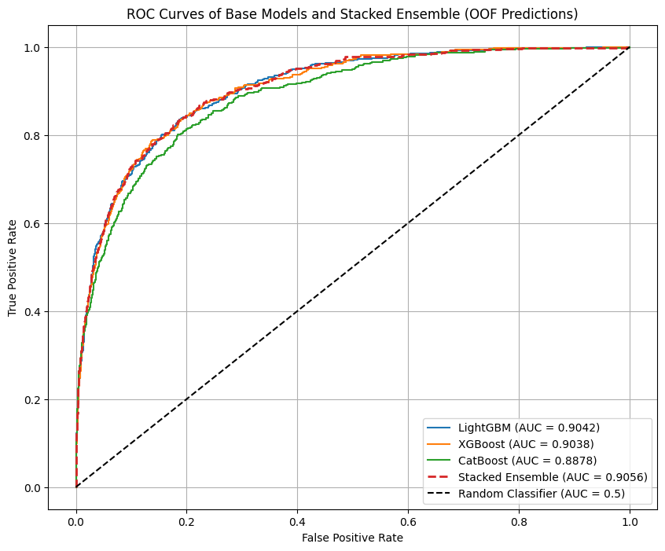

# Financial Distress & Bankruptcy Prediction

A machine learning project that predicts company bankruptcy using 64 anonymized financial attributes. The solution builds a **Stacked Ensemble** of three gradient boosting models combined via a Logistic Regression meta-model, achieving an Out-of-Fold AUC of **0.9056**.

---

## Problem Statement

Given a set of 64 normalized financial ratios for 8,000 companies, predict the probability that a company is in financial distress (binary classification: bankrupt vs. healthy). The evaluation metric is **ROC AUC**.

---

## Solution Overview

### Architecture: Two-Level Stacking Ensemble

```
Training Data
     │
     ├─── LightGBM  ──┐
     ├─── XGBoost   ──┼──► Meta-features (OOF predictions) ──► Logistic Regression ──► Final Prediction
     └─── CatBoost  ──┘
```

**Base Models (Level 0):** Each model was individually tuned via Bayesian optimization and trained with 5-fold Stratified K-Fold cross-validation to produce Out-of-Fold (OOF) predictions — preventing data leakage into the meta-model.

**Meta-Model (Level 1):** A Logistic Regression classifier (C=0.1) trained on the OOF predictions of the three base models.

### Results

| Model | OOF AUC |
|-------|---------|
| LightGBM | 0.90420 |
| XGBoost | 0.90379 |
| CatBoost | 0.88780 |
| **Stacked Ensemble** | **0.90561** |



---

## Feature Engineering Pipeline

The preprocessing pipeline applies the following steps in sequence:

1. **Missing Value Indicators** — Creates binary `_isna` flag columns for any feature with null values
2. **Median Imputation** — Fills missing values with feature medians
3. **Robust Scaling** — Scales features using IQR (resistant to outliers)
4. **Advanced Feature Engineering:**
   - 5 PCA components from the full feature set
   - 10 interaction terms (ratio and product pairs) for selected feature combinations

---

## Repository Structure

```
bankruptcy-prediction-ensemble/
│
├── bankruptcy_prediction_ensemble.ipynb    # Main notebook — full pipeline
│
├── data/
│   ├── bankruptcy_Train.csv               # 8,000 training samples, 64 features + label
│   └── bankruptcy_Test_X.csv             # 8,000 test samples, 64 features
│
├── results/
│   ├── roc_curve.png                      # ROC curve visualization
│   └── submission.csv                     # Final stacked ensemble predictions
│
├── Bankruptcy_Prediction_Presentation.pptx  # Project presentation slides
├── requirements.txt
├── .gitignore
└── README.md
```

---

## Getting Started

### 1. Clone the repo
```bash
git clone https://github.com/harshilpanchal11/bankruptcy-prediction-ensemble.git
cd bankruptcy-prediction-ensemble
```

### 2. Install dependencies
```bash
pip install -r requirements.txt
```

### 3. Run the notebook
```bash
jupyter notebook bankruptcy_prediction_ensemble.ipynb
```

> The notebook expects data files in the `data/` directory. If running on **Google Colab**, upload the CSVs or mount your Drive and update the file paths in the Data Loading section.

---

## Tech Stack

| Tool | Purpose |
|------|---------|
| Python 3.12 | Core language |
| LightGBM | Base model 1 |
| XGBoost | Base model 2 |
| CatBoost | Base model 3 |
| scikit-learn | Preprocessing, meta-model, evaluation |
| Pandas / NumPy | Data manipulation |
| Matplotlib / Plotly | Visualization |
| Google Colab | Training environment |

---

## Author

**Harshil Panchal**  
[GitHub](https://github.com/harshilpanchal11) · [LinkedIn](https://www.linkedin.com/in/harshil-panchal355/)
